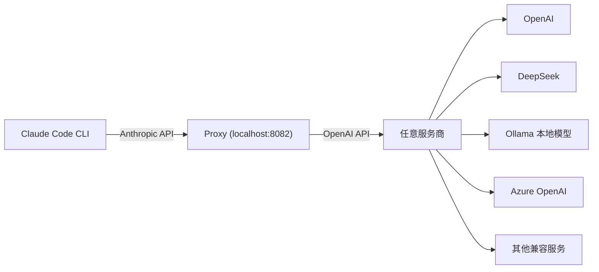

[English](README.md) | 简体中文

# Claude Code Proxy

> 一行命令，让 Claude Code 接入任意 OpenAI 兼容服务商

一个轻量级代理服务器，把 Claude Code CLI 发出的 Anthropic API 请求自动转换成 OpenAI 格式，从而让你用 **OpenAI、DeepSeek、Ollama、Azure OpenAI** 或任何兼容 OpenAI API 的大模型来驱动 Claude Code。


---

## 它能做什么？

Claude Code 默认只认 Anthropic 的 API。本项目在中间架了一层代理，帮你把请求"翻译"成 OpenAI 格式，这样你就可以自由选择后端模型了。



**核心能力：**

- 完整的 `/v1/messages` 端点兼容（streaming + 非 streaming）
- 智能模型映射（haiku / sonnet / opus 自动路由到你配置的模型）
- 完整的 Function Calling / Tool Use 支持
- 图片输入支持（Base64）
- 自定义 HTTP 请求头注入
- 客户端 API Key 验证
- Azure OpenAI 原生支持

---

## 快速开始

### 方法一：一键脚本（推荐新手）

最简单的方式，交互式引导你完成所有配置，一个终端搞定。

```bash
# 1. 克隆项目
git clone https://github.com/fengshao1227/claude-code-proxy.git
cd claude-code-proxy

# 2. 交互式配置（选择服务商、输入 API Key、自动生成 .env）
bash setup.sh

# 3. 一键启动代理 + Claude Code（单终端搞定！）
bash start.sh

# 停止代理
bash stop.sh
```

`setup.sh` 会引导你选择服务商（OpenAI / DeepSeek / Ollama / Azure / 自定义），输入 API Key，自动生成 `.env` 配置文件。

`start.sh` 会自动后台启动代理、等待就绪、然后直接帮你打开 Claude Code，无需手动设置环境变量，无需开两个终端。

### 方法二：从源码运行

适合有 Python 环境的开发者，最灵活。

```bash
# 1. 克隆项目
git clone https://github.com/fengshao1227/claude-code-proxy.git
cd claude-code-proxy

# 2. 安装依赖（推荐用 uv，没有的话用 pip 也行）
uv sync
# 或者：pip install -r requirements.txt

# 3. 复制并编辑配置文件
cp .env.example .env
# 用你喜欢的编辑器打开 .env，填入 API Key 和模型配置（详见「配置说明」章节）

# 4. 启动代理
python start_proxy.py
# 或者：uv run claude-code-proxy
```

启动后你会看到类似这样的输出：

```
🚀 Claude-to-OpenAI API Proxy v1.0.0
✅ Configuration loaded successfully
   OpenAI Base URL: https://api.openai.com/v1
   Big Model (opus): gpt-4o
   Middle Model (sonnet): gpt-4o
   Small Model (haiku): gpt-4o-mini
   Server: 0.0.0.0:8082
```

然后打开另一个终端，启动 Claude Code：

```bash
ANTHROPIC_BASE_URL=http://localhost:8082 ANTHROPIC_API_KEY="any-value" claude
```

搞定！

### 方法二：下载预编译二进制（免装 Python）

如果你不想折腾 Python 环境，可以直接下载打包好的可执行文件。

```bash
# 1. 从 GitHub Releases 下载对应平台的二进制文件
# https://github.com/fengshao1227/claude-code-proxy/releases

# 2. 添加执行权限（Linux / macOS）
chmod +x claude-code-proxy

# 3. 设置环境变量并启动
export OPENAI_API_KEY="sk-your-key-here"
export OPENAI_BASE_URL="https://api.openai.com/v1"
export BIG_MODEL="gpt-4o"
export SMALL_MODEL="gpt-4o-mini"

./claude-code-proxy
```

也可以把环境变量写到 `.env` 文件里（放在二进制文件同级目录），程序会自动加载。

### 方法三：Docker

最干净的方式，不污染宿主机环境。

```bash
# 使用 docker compose（推荐，配置写在 .env 里）
cp .env.example .env
# 编辑 .env 填入你的配置
docker compose up -d

# 或者直接用 docker run
docker run -d \
  --name claude-code-proxy \
  -p 8082:8082 \
  -e OPENAI_API_KEY="sk-your-key-here" \
  -e OPENAI_BASE_URL="https://api.openai.com/v1" \
  -e BIG_MODEL="gpt-4o" \
  -e SMALL_MODEL="gpt-4o-mini" \
  ghcr.io/fengshao1227/claude-code-proxy
```

### 启动 Claude Code

无论你用哪种方式启动了代理，都可以这样连接 Claude Code：

```bash
# 临时使用（推荐先试试看）
ANTHROPIC_BASE_URL=http://localhost:8082 ANTHROPIC_API_KEY="any-value" claude

# 写入 shell 配置文件，每次自动生效
echo 'export ANTHROPIC_BASE_URL=http://localhost:8082' >> ~/.bashrc
echo 'export ANTHROPIC_API_KEY=any-value' >> ~/.bashrc
source ~/.bashrc
claude
```

> **提示**：如果代理没有设置 `ANTHROPIC_API_KEY`，客户端填任意值即可。如果代理设置了，客户端必须填相同的值。

---

## 配置说明

### 环境变量一览表

所有配置都通过环境变量设置。你可以直接 `export`，也可以写在项目根目录的 `.env` 文件里（程序启动时自动加载）。

| 变量名 | 必填 | 默认值 | 说明 |
|--------|------|--------|------|
| `OPENAI_API_KEY` | **是** | - | 目标服务商的 API Key |
| `OPENAI_BASE_URL` | 否 | `https://api.openai.com/v1` | API 基础地址 |
| `BIG_MODEL` | 否 | `gpt-4o` | Claude opus 请求映射到的模型 |
| `MIDDLE_MODEL` | 否 | 与 `BIG_MODEL` 相同 | Claude sonnet 请求映射到的模型 |
| `SMALL_MODEL` | 否 | `gpt-4o-mini` | Claude haiku 请求映射到的模型 |
| `ANTHROPIC_API_KEY` | 否 | - | 客户端验证密钥，不设则跳过验证 |
| `HOST` | 否 | `0.0.0.0` | 服务监听地址 |
| `PORT` | 否 | `8082` | 服务监听端口 |
| `LOG_LEVEL` | 否 | `INFO` | 日志级别：DEBUG / INFO / WARNING / ERROR |
| `MAX_TOKENS_LIMIT` | 否 | `4096` | 最大 token 数限制 |
| `MIN_TOKENS_LIMIT` | 否 | `100` | 最小 token 数限制 |
| `REQUEST_TIMEOUT` | 否 | `90` | 请求超时时间（秒） |
| `MAX_RETRIES` | 否 | `2` | 最大重试次数 |
| `AZURE_API_VERSION` | 否 | - | Azure OpenAI API 版本（仅 Azure 需要） |

### 服务商配置示例

#### OpenAI

```bash
OPENAI_API_KEY="sk-your-openai-key"
OPENAI_BASE_URL="https://api.openai.com/v1"
BIG_MODEL="gpt-4o"
MIDDLE_MODEL="gpt-4o"
SMALL_MODEL="gpt-4o-mini"
```

#### DeepSeek（国内推荐）

国内开发者首选，速度快、价格低、中文能力强。

```bash
OPENAI_API_KEY="sk-your-deepseek-key"
OPENAI_BASE_URL="https://api.deepseek.com/v1"
BIG_MODEL="deepseek-chat"
MIDDLE_MODEL="deepseek-chat"
SMALL_MODEL="deepseek-chat"
```

> 在 [DeepSeek 开放平台](https://platform.deepseek.com/) 注册即可获取 API Key，无需翻墙。

#### Ollama（本地部署）

完全本地运行，不需要任何 API Key，适合对隐私有要求或者想省钱的场景。

```bash
# 先确保 Ollama 已安装并运行：https://ollama.ai
# 然后拉取模型：ollama pull llama3.1:70b

OPENAI_API_KEY="dummy-key"          # 必填，但随便填
OPENAI_BASE_URL="http://localhost:11434/v1"
BIG_MODEL="llama3.1:70b"
MIDDLE_MODEL="llama3.1:70b"
SMALL_MODEL="llama3.1:8b"
```

#### Azure OpenAI

适合企业用户或 OpenAI 直连不稳定的情况。

```bash
OPENAI_API_KEY="your-azure-api-key"
OPENAI_BASE_URL="https://your-resource.openai.azure.com/openai/deployments/your-deployment"
AZURE_API_VERSION="2024-03-01-preview"
BIG_MODEL="gpt-4"
MIDDLE_MODEL="gpt-4"
SMALL_MODEL="gpt-35-turbo"
```

#### 自定义服务商

任何兼容 OpenAI Chat Completions API 的服务都可以接入，只需修改 `OPENAI_BASE_URL` 指向对应地址即可。常见的包括：

- **硅基流动 (SiliconFlow)**：`https://api.siliconflow.cn/v1`
- **零一万物 (01.AI)**：`https://api.lingyiwanwu.com/v1`
- **Moonshot (Kimi)**：`https://api.moonshot.cn/v1`
- **智谱 AI (GLM)**：`https://open.bigmodel.cn/api/paas/v4`
- **OpenRouter**：`https://openrouter.ai/api/v1`

---

## 模型映射

代理会根据 Claude Code 请求的模型名称中的关键词，自动路由到你配置的模型：

| Claude Code 请求的模型 | 匹配关键词 | 映射到 | 环境变量 |
|------------------------|-----------|--------|----------|
| `claude-3-haiku-*` | `haiku` | `SMALL_MODEL` | 默认 `gpt-4o-mini` |
| `claude-3-5-sonnet-*` | `sonnet` | `MIDDLE_MODEL` | 默认与 `BIG_MODEL` 相同 |
| `claude-3-opus-*` | `opus` | `BIG_MODEL` | 默认 `gpt-4o` |
| 其他未知模型 | - | `BIG_MODEL` | 兜底策略 |

> **小贴士**：如果你只想用一个模型，把 `BIG_MODEL`、`MIDDLE_MODEL`、`SMALL_MODEL` 都设成一样就行。

---

## 常见问题

### Claude Code 是什么？怎么安装？

[Claude Code](https://docs.anthropic.com/en/docs/claude-code) 是 Anthropic 官方推出的命令行编程助手。安装方式：

```bash
npm install -g @anthropic-ai/claude-code
```

安装后在终端输入 `claude` 即可启动。它默认使用 Anthropic 的 API，而本项目的作用就是让它可以对接其他服务商。

### 国内无法直接访问 OpenAI 怎么办？

几种方案：

1. **用 DeepSeek**（推荐）：国内直连，注册即用，参考上面的配置示例
2. **用 Ollama 本地部署**：完全离线，不需要任何外网访问
3. **用 Azure OpenAI**：微软云服务，国内部分区域可访问
4. **用国内中转服务**：把 `OPENAI_BASE_URL` 指向中转地址即可
5. **用 SiliconFlow / OpenRouter 等聚合平台**：一个 Key 访问多种模型

### 如何让 Claude Code 每次自动使用代理？

把环境变量写入你的 shell 配置文件：

```bash
# bash 用户
echo 'export ANTHROPIC_BASE_URL=http://localhost:8082' >> ~/.bashrc
echo 'export ANTHROPIC_API_KEY=any-value' >> ~/.bashrc
source ~/.bashrc

# zsh 用户（macOS 默认）
echo 'export ANTHROPIC_BASE_URL=http://localhost:8082' >> ~/.zshrc
echo 'export ANTHROPIC_API_KEY=any-value' >> ~/.zshrc
source ~/.zshrc
```

这样每次打开终端直接输入 `claude` 就会走代理。

### 支持哪些模型？

理论上任何兼容 OpenAI Chat Completions API (`/v1/chat/completions`) 的模型都能用。包括但不限于：

- OpenAI: GPT-4o, GPT-4o-mini, o1 系列
- DeepSeek: deepseek-chat, deepseek-coder
- Meta: Llama 3.1 系列（通过 Ollama 或 API）
- 阿里: Qwen 系列
- 智谱: GLM-4 系列
- Mistral: Mistral Large, Codestral

### 遇到报错怎么办？

**"OPENAI_API_KEY not found"**
→ 检查 `.env` 文件是否存在且包含 `OPENAI_API_KEY`

**"Invalid API key"**
→ 检查 `OPENAI_API_KEY` 是否正确；如果用的不是 OpenAI，Key 格式可能不以 `sk-` 开头，这是正常的

**"unsupported_country_region_territory"**
→ OpenAI 不支持你所在的地区。换用 DeepSeek、Azure 或本地模型

**"Model not found"**
→ 检查 `BIG_MODEL` / `SMALL_MODEL` 是否是目标服务商支持的模型名

**连接超时**
→ 检查 `OPENAI_BASE_URL` 是否可达；可以尝试增大 `REQUEST_TIMEOUT`

**端口被占用**
→ 修改 `PORT` 环境变量，比如 `PORT=8083`

开启详细日志可以帮助排查问题：

```bash
LOG_LEVEL=DEBUG python start_proxy.py
```

---

## 进阶配置

### 自定义 HTTP Headers

如果你的 API 服务商需要特殊请求头，可以通过 `CUSTOM_HEADER_*` 环境变量注入：

```bash
# 在 .env 文件中添加
CUSTOM_HEADER_ACCEPT="application/jsonstream"
CUSTOM_HEADER_X_API_KEY="your-special-key"
CUSTOM_HEADER_USER_AGENT="my-app/1.0.0"
```

转换规则：`CUSTOM_HEADER_` 前缀会被去掉，下划线 `_` 转为连字符 `-`。

例如 `CUSTOM_HEADER_X_API_KEY` → HTTP Header `X-API-KEY`。

### API Key 验证

如果你把代理部署在公网，建议设置 `ANTHROPIC_API_KEY` 来限制访问：

```bash
# 代理端设置
ANTHROPIC_API_KEY="my-secret-key-123"

# 客户端使用时必须提供相同的 Key
ANTHROPIC_BASE_URL=http://your-server:8082 ANTHROPIC_API_KEY="my-secret-key-123" claude
```

不设置的话，任何人都可以通过代理调用你的 API，产生费用。

### 性能调优

```bash
# 增大超时时间（适合慢速模型或大上下文请求）
REQUEST_TIMEOUT=180

# 调大 token 限制
MAX_TOKENS_LIMIT=8192

# 降低日志级别减少 I/O 开销
LOG_LEVEL=WARNING

# 调整最大重试次数
MAX_RETRIES=3
```

---

## 项目结构

```
claude-code-proxy/
├── src/                             # 核心代码
│   ├── api/endpoints.py             # FastAPI 路由（/v1/messages 等）
│   ├── conversion/
│   │   ├── request_converter.py     # Claude → OpenAI 请求转换
│   │   └── response_converter.py    # OpenAI → Claude 响应转换
│   ├── core/
│   │   ├── client.py                # OpenAI / Azure 异步客户端
│   │   ├── config.py                # 环境变量配置加载
│   │   ├── constants.py             # 常量定义
│   │   └── model_manager.py         # 模型映射逻辑
│   ├── models/claude.py             # Claude API 数据模型
│   └── main.py                      # 应用入口 + uvicorn 启动
├── setup.sh                         # 交互式配置向导
├── start.sh                         # 一键启动（代理 + Claude Code）
├── stop.sh                          # 停止后台代理
├── start_proxy.py                   # Python 直接启动入口
├── .env.example                     # 配置文件模板
├── claude-code-proxy.spec           # PyInstaller 打包配置
├── Dockerfile                       # Docker 镜像构建
├── docker-compose.yml               # Docker Compose 编排
└── pyproject.toml                   # 项目元数据和依赖
```

---

## 开发指南

欢迎贡献代码！以下是本地开发流程：

```bash
# 克隆并安装依赖
git clone https://github.com/fengshao1227/claude-code-proxy.git
cd claude-code-proxy
uv sync

# 启动开发服务器
uv run claude-code-proxy

# 运行测试
python src/test_claude_to_openai.py

# 代码格式化
uv run black src/
uv run isort src/

# 类型检查
uv run mypy src/
```

**技术栈**：Python 3.9+ / FastAPI / uvicorn / openai SDK / pydantic

---

## License

[MIT License](LICENSE) - 随便用，不用谢。
